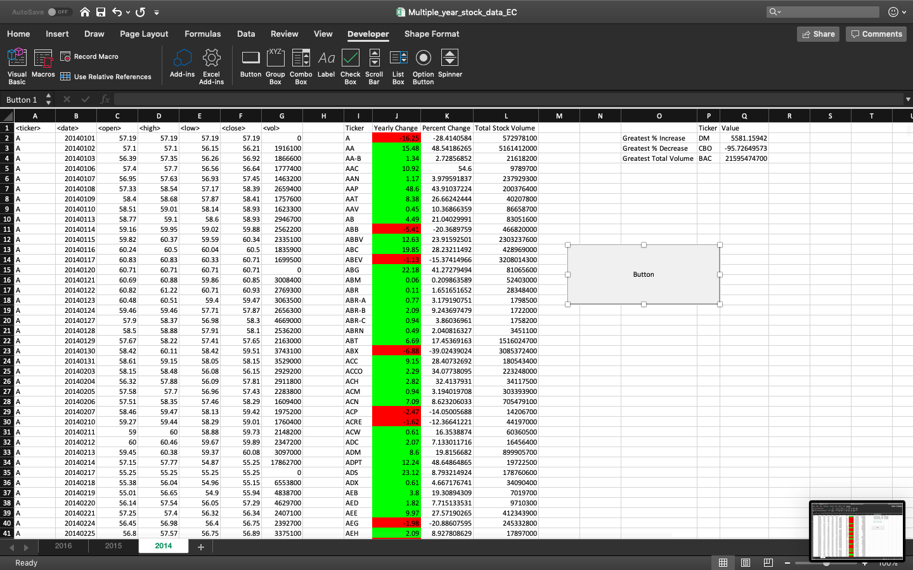
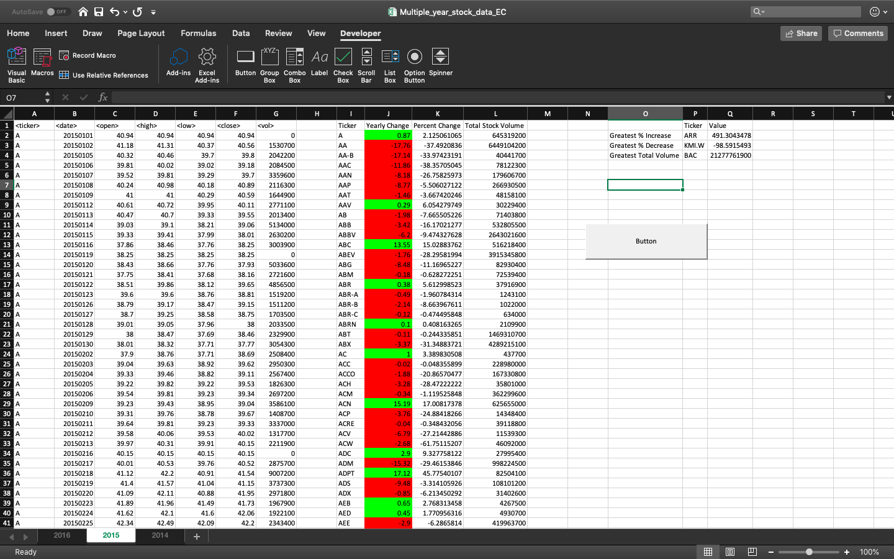
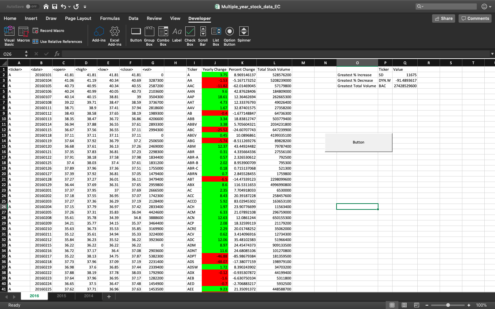

# Homework Assignment - The VBA of Wall Street

## Background

Use VBA scripting to analyze real stock market data.

### Level 1 - Easy:

* Create a script that will loop through each year of stock data and grab the total amount of volume each stock had over the year.
* Display the ticker symbol to coincide with the total volume.

### Level 2 - Moderate:

* Create a script that will loop through all the stocks and take the following info.
  * Yearly change from what the stock opened the year at to what the closing price was.
  * The percent change from the what it opened the year at to what it closed.
  * The total Volume of the stock
  * Ticker symbol
  * Include conditional formatting that will highlight positive change in green and negative change in red.
  
###  Level 3 - Hard:

* The solution will include everything from the moderate challenge.
* The solution will also be able to locate the stock with the "Greatest % increase", "Greatest % Decrease" and "Greatest total volume".
* Make the appropriate adjustments to the script that will allow it to run on every worksheet just by running it once.

**2014 Stock Market Analysis Screenshot:** 

**2015 Stock Market Analysis Screenshot:** 

**2016 Stock Market Analysis Screenshot:** 

